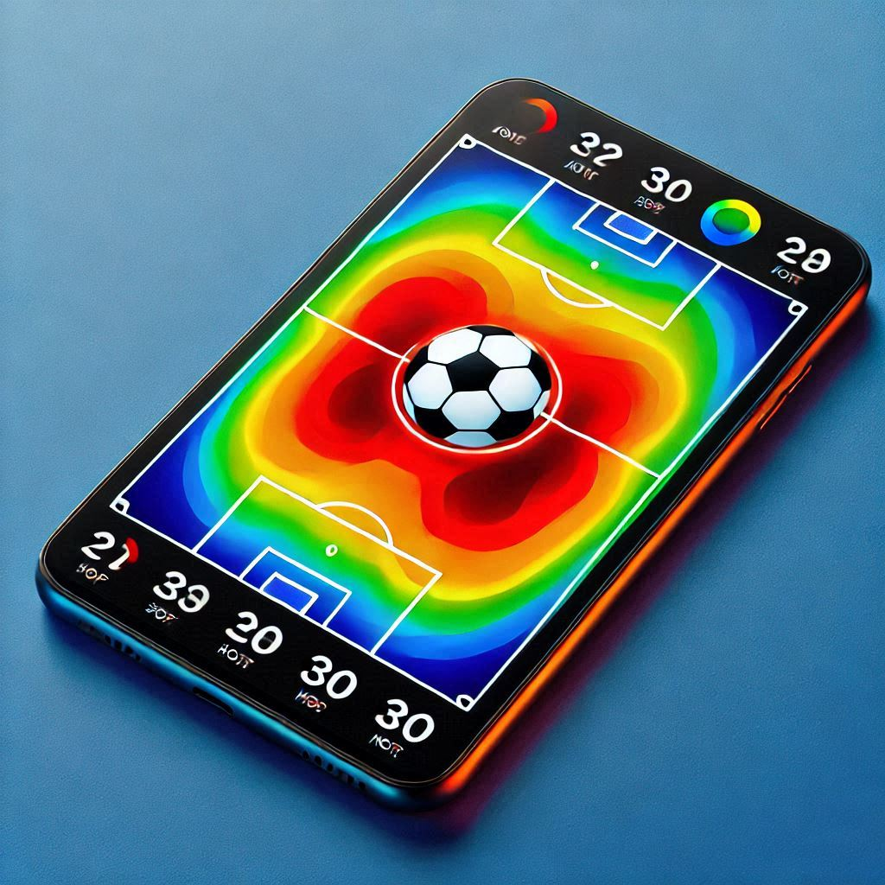
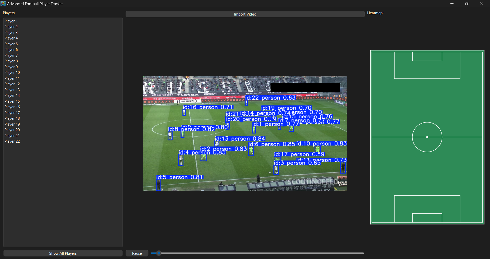
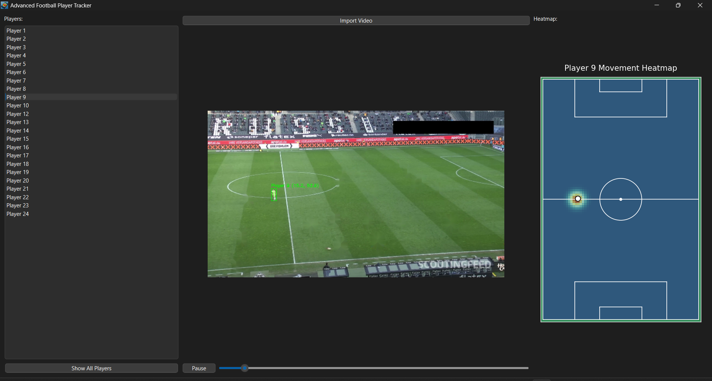

# Football Heatmap Application



---

## Overview

The **Football Heatmap Application** is a state-of-the-art Python-based tool designed for analyzing football player movements. Featuring two distinct modes—**Preprocessing** and **Real-time Tracking**—the application empowers users to generate insightful heatmaps of player activity, either beforehand or dynamically during video playback.

Built with advanced machine learning and a user-friendly interface, this application enables in-depth analysis of individual players. Users can isolate players, visualize their movements, and export heatmaps for further analysis, all seamlessly integrated into the app.

---

## Key Features

### 1. **Dual Modes of Operation**
- **Preprocessing Mode**:
  - Processes entire videos in advance.
  - Generates and saves static heatmaps for each player.
  - Ideal for batch processing and large-scale analysis.

- **Real-time Tracking Mode**:
  - Tracks player movements dynamically during video playback.
  - Updates heatmaps frame by frame for live analysis.
  - Perfect for real-time insights during matches.

### 2. **Advanced Player Isolation and Selection**
- Dynamically select players from an intuitive menu.
- Focus on individual players by hiding others.
- Track and visualize the exclusive movements of the selected player.

### 3. **Heatmap Visualization**
- Heatmaps are enhanced with Gaussian smoothing for precision.
- Export heatmaps as high-quality images suitable for reports and presentations.
- View both individual and cumulative player heatmaps effortlessly.

### 4. **Intuitive User Interface**
- Built with PyQt6 for a responsive and visually appealing experience.
- Key features include:
  - Player selection menu.
  - Video playback controls (play, pause, frame-by-frame navigation).
  - Dynamic and seamless heatmap rendering.

### 5. **Robust Error Handling**
- Comprehensive error messages guide users through common issues, such as missing files or unsupported video formats.

### 6. **Cutting-edge Machine Learning Integration**
- Employs YOLOv8 for real-time player detection.
- Ensures accurate tracking with DBSCAN clustering.

---

## Visual Previews

### Real-time Tracking


### Player Selection and Heatmap Visualization


---

## Installation Guide

Follow the steps below to set up the Football Heatmap Application:

### Prerequisites
- Python 3.8 or later.
- `pip` (Python package manager).
- YOLOv8 model file (`yolov8m.pt`).

### Installation Steps
1. **Clone the Repository**:
   ```bash
   git clone https://github.com/YourUsername/FootballHeatmapApp.git
   cd FootballHeatmapApp
   ```

2. **Set Up a Virtual Environment**:
   ```bash
   python -m venv venv
   source venv/bin/activate  # On Windows: venv\Scripts\activate
   ```

3. **Install Dependencies**:
   ```bash
   pip install -r requirements.txt
   ```

4. **Run the Application**:
   - For **Real-time Tracking Mode**:
     ```bash
     python app/Players_Heatmap_Real-timeproccessing.py
     ```
   - For **Preprocessing Mode**:
     ```bash
     python app/Players_Heatmap_Preproccessing.py
     ```

---

## Usage Workflow

### Preprocessing Mode
1. Run the `Players_Heatmap_Preproccessing.py` script.
2. The app will process the video, track players, and save heatmaps in the `heatmaps` directory.

### Real-time Tracking Mode
1. Launch the `Players_Heatmap_Real-timeproccessing.py` script.
2. Select players from the menu to isolate and visualize their movements in real-time.

---

## Notes

- Ensure the YOLOv8 model file (`yolov8m.pt`) is placed in the app's root directory.
- Heatmaps in **Preprocessing Mode** are saved in the `heatmaps` folder.
- Supported video formats: `.mp4`, `.avi`, `.mkv`.

---

## Contribution Guidelines

We welcome contributions to enhance this project! To contribute:
1. Fork the repository.
2. Create a new branch for your feature or bug fix.
3. Submit a pull request detailing your changes.

---

## License

This project is licensed under the [MIT License](LICENSE).

---

## Meet the Team

This project was developed by a passionate and talented team:

- [**Sief Eldin Sameh**](https://github.com/SiefEldinSameh)
- [**Fahd Ahmed**](https://github.com/fahdahmed10)
- [**Ahmed Salem**](https://github.com/Ahmedo0oSalem)
- [**Karim Farid**](https://github.com/eslamFared)

---

Discover the power of the **Football Heatmap Application** and take your football analysis to the next level!

